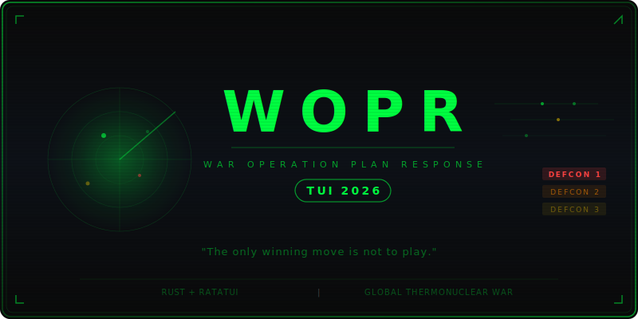

<div align="center">



**A modern terminal reimagining of the 1983 WarGames WOPR system.**

*"Shall we play a game?"*

[](https://www.rust-lang.org/)
[](LICENSE)
[](CONTRIBUTING.md)
[](https://github.com/ankurCES/WOPR_TUI_2026/stargazers)

</div>

---

## Background

In the 1983 film [*WarGames*](https://en.wikipedia.org/wiki/WarGames), a young hacker accidentally connects to WOPR (War Operation Plan Response) — a U.S. military supercomputer running nuclear war simulations at NORAD's Cheyenne Mountain complex. Thinking it's a game, he starts a simulation of Global Thermonuclear War that nearly triggers World War III. The computer, unable to distinguish simulation from reality, begins the countdown to launch.

The film's central question — *"Is it a game, or is it real?"* — resonated with an entire generation. WOPR's final lesson, after exhaustively playing every scenario of tic-tac-toe and nuclear war, remains one of cinema's most iconic lines:

> **"A strange game. The only winning move is not to play."**

**WOPR TUI 2026** brings that experience to your terminal. You step into the role of a military advisor at a Cold War–era command center, responding to escalating geopolitical crises. An AI generates scenarios with multi-language intelligence intercepts, and your decisions push the world toward peace — or the brink of nuclear annihilation.

## Screenshots

<div align="center">

| World Map & Intelligence Comms | DEFCON Escalation |
|:---:|:---:|
|  |  |

| Scenario Decisions | Threat Assessment |
|:---:|:---:|
|  |  |

</div>

## Features

- **ASCII World Map** — Continental outlines with 9 strategic locations, threat overlays, and animated missile trajectories
- **DEFCON System** — Levels 5→1 with ±1 step enforcement, visual gauge, and color-coded escalation
- **Intelligence Comms** — Multi-language intercepts (English, Russian Cyrillic, Chinese simplified) with priority coloring and signal garble effects
- **AI Scenario Engine** — LLM-generated crises with 4 player options per turn, consequence heuristics, and endgame detection
- **Multiple LLM Providers** — Stub (6 canned scenarios, no API key needed), Anthropic Claude, and Minimax
- **WarGames Boot Sequence** — Authentic CRT-style boot animation with Joshua login prompt
- **Animations** — Braille spinners, typewriter text, pulse/radar overlays, nerd font detection with fallbacks

## Quick Start

### One-liner install

```bash
curl -fsSL https://raw.githubusercontent.com/ankurCES/WOPR_TUI_2026/main/install.sh | bash
```

The installer boots up like a WOPR terminal — log in as **Joshua** when prompted. It handles Rust, system deps, and builds from source.

Then launch:

```bash
wopr
```

### Build from source

```bash
git clone https://github.com/ankurCES/WOPR_TUI_2026.git
cd WOPR_TUI_2026
cargo install --path .
```

### Controls

| Key | Action |
|-----|--------|
| `Tab` / `Shift+Tab` | Cycle modes (MainMap → Comms → Settings → Scenario → Defcon) |
| `↑` / `↓` | Select option in scenario view |
| `Enter` | Submit decision |
| `?` | Help overlay |
| `q` | Quit |

## Configuration

Reads LLM settings from `~/.blumi/settings.json`:

```json
{
  "llm": { "provider": "minimax", "model": "MiniMax-M3" },
  "providers": {
    "minimax": {
      "api_key": "sk-...",
      "base_url": "https://api.minimax.io/anthropic",
      "kind": "anthropic"
    }
  }
}
```

No config needed to play — falls back to the stub provider with 6 built-in scenarios.

## Architecture

```
src/
├── app.rs              # Main event loop + game flow
├── main.rs             # Entry point
├── state.rs            # AppState (DEFCON, scenarios, comms, threats)
├── event.rs            # AppEvent channel
├── config.rs           # Settings loader
├── terminal.rs         # Terminal init/restore, capability detection
├── game/
│   ├── types.rs        # Country, ScenarioCategory, CommPriority
│   ├── scenario.rs     # Scenario parsing from LLM output
│   ├── context.rs      # GameContext accumulator (JSON history)
│   ├── comms.rs        # Multi-language comm generation
│   ├── consequence.rs  # Decision → game event mapping
│   ├── defcon.rs       # DEFCON level transitions
│   ├── endgame.rs      # Win/loss detection + ASCII art
│   ├── events.rs       # GameEvent enum
│   └── prompts.rs      # System + scenario prompts for LLM
├── llm/
│   ├── types.rs        # LlmProvider trait, LlmRequest/Response
│   ├── stub.rs         # 6 canned scenarios (Russian/Chinese comms)
│   ├── anthropic.rs    # Anthropic Claude provider
│   └── minimax.rs      # Minimax provider
└── ui/
    ├── layout.rs       # Mode-based layout routing
    ├── world_map.rs    # ASCII continents + city markers
    ├── threat_overlay.rs # Missiles, threats, bases
    ├── comms_panel.rs  # Scrollable comms feed
    ├── decision.rs     # Scenario + options panel
    ├── icons.rs        # Nerd font / ASCII fallback icons
    └── anim.rs         # Braille spinner, typewriter, pulse
```

## Tech Stack

| Crate | Purpose |
|-------|---------|
| [ratatui](https://ratatui.rs) 0.30 | Terminal UI framework |
| [crossterm](https://github.com/crossterm-rs/crossterm) 0.28 | Terminal backend |
| [tokio](https://tokio.rs) | Async runtime |
| [reqwest](https://docs.rs/reqwest) | HTTP client for LLM providers |
| [serde](https://serde.rs) | JSON serialization |

## Contributing

Contributions welcome! See [CONTRIBUTING.md](CONTRIBUTING.md) for guidelines.

Whether it's a bug fix, new LLM provider, UI improvement, or better scenario content — PRs are encouraged. Please read the [Code of Conduct](CODE_OF_CONDUCT.md) before participating.

## Roadmap

- [ ] Live LLM streaming (token-by-token scenario generation)
- [ ] Save/load game state
- [ ] Multiplayer mode (adversarial — one player per superpower)
- [ ] Additional map theaters (Europe, Pacific, Middle East)
- [ ] Sound effects via terminal bell sequences
- [ ] Screenshot/recording export

## Star History

<div align="center">

[](https://star-history.com/#ankurCES/WOPR_TUI_2026&Date)

</div>

## License

[MIT](LICENSE) — do whatever you want, just don't start an actual thermonuclear war.

---

<div align="center">

*"The only winning move is not to play."*
— WOPR, 1983

</div>
